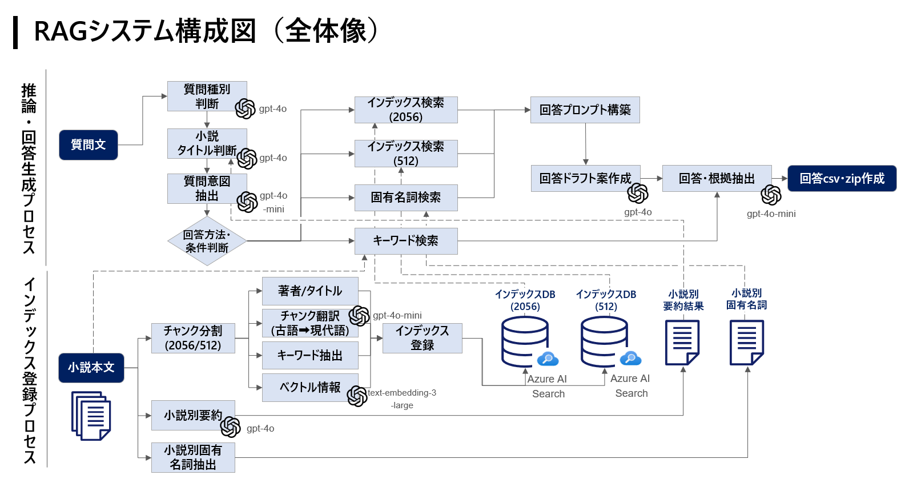

# SIGNATE RAG1 グランプリ ソースコード

このリポジトリには、SIGNATE RAG1 グランプリのソースコードが含まれています。

## フォルダ構成

- `input`: query.csv の質問ファイル
- `src`:
  - `data`: 小説の index ファイル
  - `pretreatment`: 小説別固有名詞の抽出
  - `prompts`: 各プロンプトファイル
- `rag1_src.ipynb`: インデックス作成、RAG 実行ファイル
- `submit`: 出力ファイル

## 構成図

